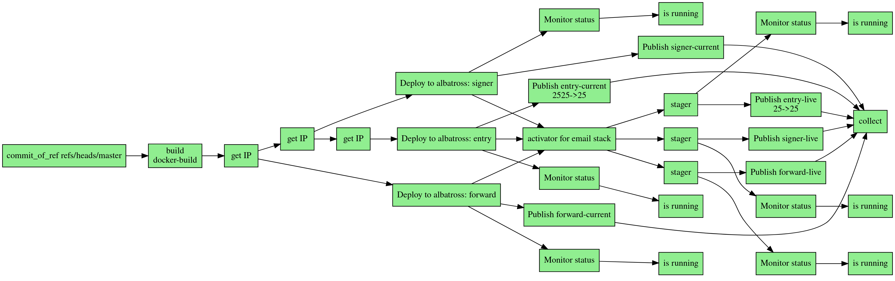

# current-albatross-deployer

This is an [ocurrent](https://github.com/ocurrent/ocurrent) plugin to manage deployment of 
unikernels. It's specialized for linux, using [Albatross](https://github.com/roburio/albatross) 
for orchestrating the virtual machines and `iptables` for exposing ports.  

It's been made with _zero downtime_ in mind, meaning that when an unikernel is updated, a new 
instance is started while keeping the old one alive, and the switch to the new instance is managed
using a port redirection to the new IP.


_An example pipeline:_

## Installation

### Using Opam

```bash
opam pin https://github.com/TheLortex/current-albatross-deployer
```

### Installing current-iptables-daemon

```bash
git clone https://github.com/TheLortex/current-albatross-deployer
cd current-albatross-deployer
opam install --deps-only .
dune build
cd lib/iptables-daemon/packaging/Linux
sudo ./install.sh
```

The daemon runs as a systemd service named `current-iptables-daemon`.

### Installing albatross

See https://github.com/roburio/albatross

## Usage

This plugin provides _ocurrent_ primitives to compose a pipeline. A bit of familiarity with _ocurrent_
is therefore advised. 

Prelude:
```ocaml
open Current_albatross_deployer
```

### Step 1: build an unikernel

The entry point of the deployment pipeline is unikernel images, there are two ways of building them:

#### 1.a: from Docker

Extracting the unikernel binary from a previously build docker image.
```ocaml
module Docker = Current_docker.Default 

let image: Docker.Image.t Current.t = Docker.build ...

let unikernel: Unikernel.t Current.t = Unikernel.of_docker ~image ~location:(Fpath.v "/unikernel.hvt)
```

#### 1.b: from Git

```ocaml
module Git = Current_git

let repo: Git.Commit.t Current.t = Git.clone "https://github.com/mirage/mirage-www"

let unikernel: Unikernel.t Current.t = 
    let mirage_version = `Mirage_3 in
    let config_file = Fpath.v "/src/config.ml" in
    Unikernel.of_git ~mirage_version ~config_file repo
```

### Step 2: configure the unikernel

The unikernel pre-configuration is made of the unikernel image, a service name, runtime arguments as a function of the unikernel's ip, a memory limit and a deployment network:
```ocaml
let config_pre: Config.Pre.t Current.t = 
    let+ unikernel = unikernel in
    {
        Config.Pre.service = "website";
        unikernel;
        args = (fun ip -> ["--ipv4="^(Ipaddr.V4.to_string ip)^"/24"]);
        memory = 256;
        network = "br0";
    }
```
Note that the `let+` operator from `Current.Syntax` allowing to map an `Unikernel.t` to its pre-configuration.

Then the pre-configuration can be used to allocate an IP, two different configurations would generate different IPs. This IP is then used to obtain the configured unikernel:
```ocaml
let ip: Ipaddr.V4.t Current.t = 
    let blacklist = Ipaddr.V4.of_string_exn "10.0.0.1" in
    let prefix = Ipaddr.V4.Prefix.of_string_exn "10.0.0.1/24" in
    get_ip ~blacklist ~prefix config_pre

let config: Config.t Current.t =
    let+ ip = ip
    and+ config = config 
    in
    Config.v config ip
```
Note that the IP could be used to configure other unikernels, such as in a chain of microservices. The `example/` folder demonstrates such a chain, and shows how to implement zero-downtime updates by using a custom _staging_ module allowing to have two co-existing unikernel chains.

### Step 3: deploy and monitor the unikernel

This part of the pipeline interacts with `albatross` to create an unikernel and monitor it.

```ocaml
let deployed: Deployed.t Current.t = deploy_albatross config

let monitor: Info.t Current.t = monitor deployed
```

### Step 4: publish and expose ports

When the unikernel is created it can be exposed to the internet via the host machine by setting up NAT forwarding. The `iptbles-daemon` module takes care of that, creating a `CURRENT-DEPLOYER` chain in the `nat` table to set up redirection rules. Here, external port 8080 is redirected to the unikernel port 80. 

```ocaml
let published: Published.t Current.t = 
    let service = "website" in
    let ports = [{Port.source = 8080; target = 80}] in
    publish ~service ~ports deployed
```

### Step 5: garbage collection

Finally, a `collect` primitive is available to free IPs and albatross VMs when they are not useful anymore. For now, it's a process that requires manual activation:
```ocaml
let collected: unit Current.t = collect (Current.list_seq [published])
```

## To do

- Use iptables forward rules to provide more isolation between unikernels as they usually live on 
  the same network.
- Better handle errors (see TODOs in the code)

## Contributing

Take a look at our [Contributing Guide](CONTRIBUTING.md).

## Acknowledgement

`current-albatross-deployer` has received funding from the Next Generation Internet Initiative (NGI) within the framework of the DAPSI Project
